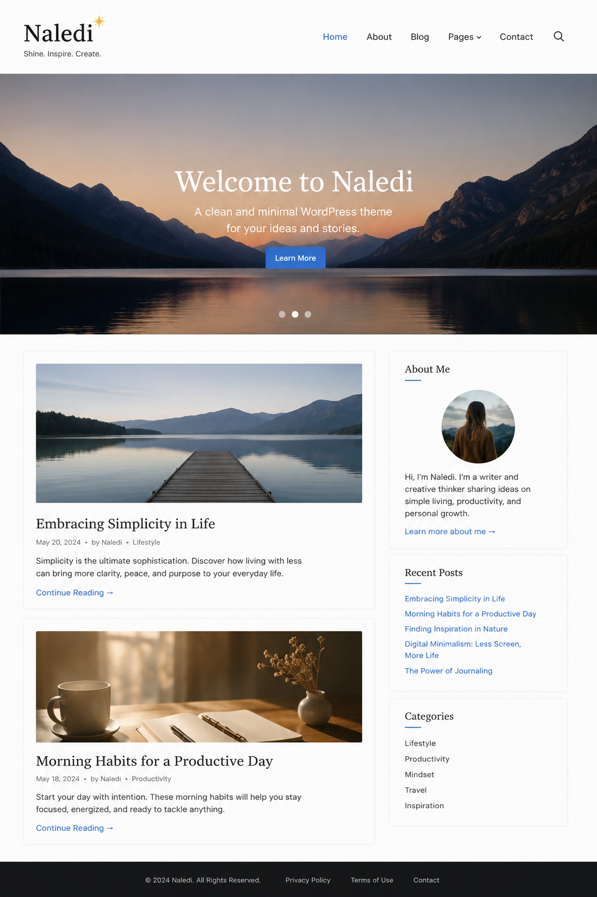

# Naledi WordPress Theme

A custom WordPress theme built for local business websites. Responsive, WooCommerce-ready, with custom post types and widget areas.

Built from the Underscores starter theme.

## Features

- Responsive layout (mobile-first)
- WooCommerce integration
- Custom post types for business listings
- Custom widget areas
- Theme customizer options
- SEO-ready markup
- Translation-ready

## Setup

1. Upload the theme to `/wp-content/themes/`
2. Activate it from WordPress Admin → Appearance → Themes
3. Customize via Appearance → Customize

## Requirements

- WordPress 6.4+
- PHP 7.4+
